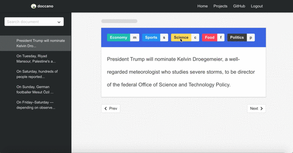
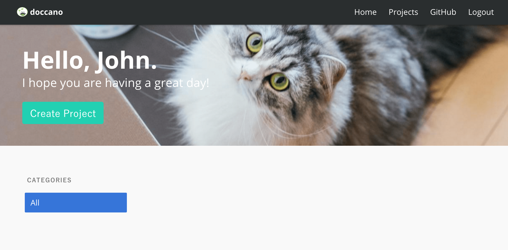
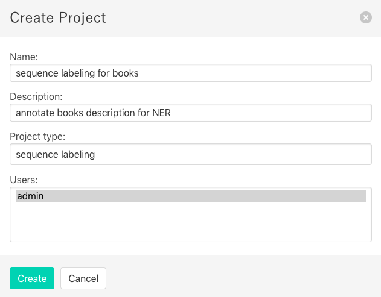
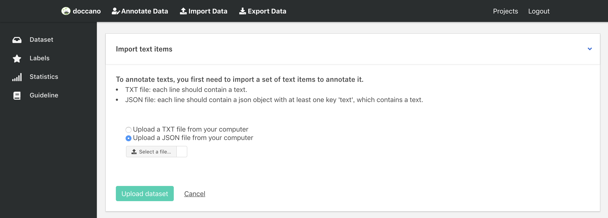
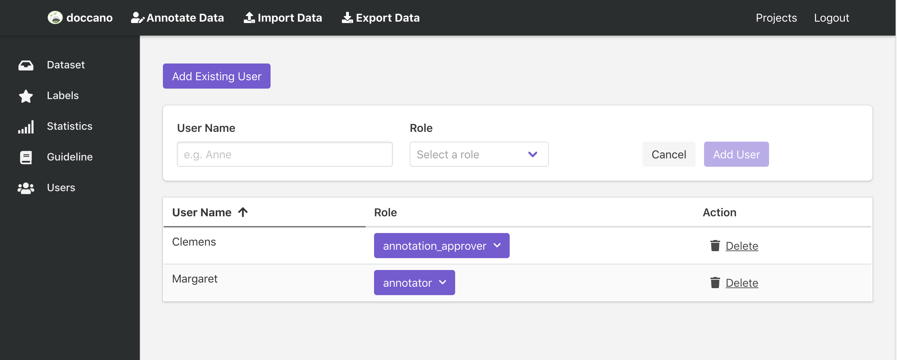
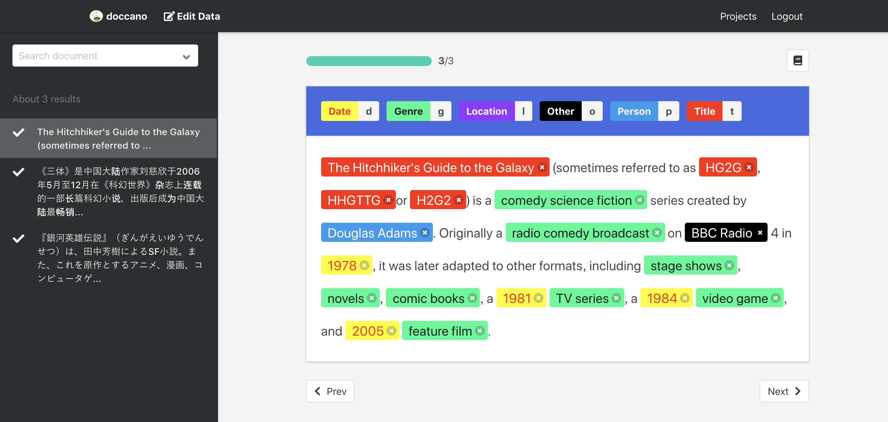
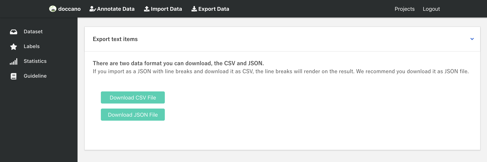

# Annotator

Annotator is a fork of [doccano](https://github.com/doccano/doccano) project.


### [Named entity recognition](https://doccano.herokuapp.com/demo/named-entity-recognition/)

The first demo is a sequence labeling task: named-entity recognition. You just select text spans and annotate them. Doccano supports shortcut keys, so you can quickly annotate text spans.


### [Sentiment analysis](https://doccano.herokuapp.com/demo/text-classification/)

The second demo is a text classification task: sentiment analysis. Since there may be more than one category, you can annotate with multiple labels.



### [Machine translation](https://doccano.herokuapp.com/demo/translation/)

The final demo is a sequence to sequence task: machine translation. Since there may be more than one response in sequence to sequence tasks, you can create multiple responses.


## Features

-   Collaborative annotation
-   Multi-Language support
-   Emoji :smile: support
-   (future) Auto labeling

## Requirements

-   Python 3.6+
-   Django 2.1.7+
-   Node.js 8.0+

## Installation

### Clone repository

First of all, you have to clone the repository:

```bash
git clone https://github.com/hhuslamlab/annotator.git
cd annotator
```

_Note for Windows developers: Be sure to configure git to correctly handle line endings or you may encounter `status code 127` errors while running the services in future steps. Running with the git config options below will ensure your git directory correctly handles line endings._

```bash
git clone https://github.com/hhuslamlab/annotator.git --config core.autocrlf=input
```

### Installation

First we need to install the dependencies. Run the following commands:

```bash
sudo apt-get install libpq-dev unixodbc unixodbc-dev npm
pip install -r requirements.txt
cd app
```

Next we need to start the webpack server so that the frontend gets compiled continuously.
Run the following commands in a new shell:

```bash
cd server/static
npm install
npm run build
# npm start  # for developers
cd ..
```

## Usage

### Start the development server

Let’s start the development server and explore it.

#### Running Django development server

Before running, we need to make migration. Run the following command:

```bash
python manage.py migrate
```

Next we need to create a user who can login to the admin site. Run the following command:

```bash
python manage.py create_admin --noinput --username "admin" --email "admin@example.com" --password "password"
```

Create the admin, annotator, and annotation approver roles to assign to users. Run the following command:

```bash
python manage.py create_roles
```

Developers can also validate that the project works as expected by running the tests:

```bash
python manage.py test server.tests
```

Finally, to start the server, run the following command:

```bash
python manage.py runserver
```

Optionally, you can change the bind ip and port using the command

```bash
python manage.py runserver <ip>:<port>
```


### Confirm all cheyalli services are running
Open a Web browser and go to <http://127.0.0.1:8000/login/>. You should see the login screen:


### Create a project

Now, try logging in with the superuser account you created in the previous step. You should see the annotator project list page:



There is no project created yet. To create your project, make sure you’re in the project list page and select `Create Project` button. You should see the following screen:



In this step, you can select three project types: text classification, sequence labeling and sequence to sequence. You should select a type with your purpose.

### Import Data

After creating a project, you will see the "Import Data" page, or click `Import Data` button in the navigation bar. You should see the following screen:



You can upload the following types of files (depending on project type):

-   `Text file`: file must contain one sentence/document per line separated by new lines.
-   `CSV file`: file must contain a header with `"text"` as the first column or be one-column csv file. If using labels the second column must be the labels.
-   `Excel file`: file must contain a header with `"text"` as the first column or be one-column excel file. If using labels the second column must be the labels. Supports multiple sheets as long as format is the same.
-   `JSON file`: each line contains a JSON object with a `text` key. JSON format supports line breaks rendering.

> Notice: Doccano won't render line breaks in annotation page for sequence labeling task due to the indent problem, but the exported JSON file still contains line breaks.

`example.txt/csv/xlsx`

```txt
EU rejects German call to boycott British lamb.
President Obama is speaking at the White House.
He lives in Newark, Ohio.
...
```

`example.json`

```JSON
{"text": "EU rejects German call to boycott British lamb."}
{"text": "President Obama is speaking at the White House."}
{"text": "He lives in Newark, Ohio."}
...
```

Any other columns (for csv/excel) or keys (for json) are preserved and will be exported in the `metadata` column or key as is.

Once you select a TXT/JSON file on your computer, click `Upload dataset` button. After uploading the dataset file, we will see the `Dataset` page (or click `Dataset` button list in the left bar). This page displays all the documents we uploaded in one project.

### Define labels

Click `Labels` button in left bar to define your own labels. You should see the label editor page. In label editor page, you can create labels by specifying label text, shortcut key, background color and text color.


### Assign Roles to Users

Click `Users` button in left bar to assign project users to annotator, admin, or annotation approval roles.



### Annotation

Now, you are ready to annotate the texts. Just click the `Annotate Data` button in the navigation bar, you can start to annotate the documents you uploaded.



### Export Data

After the annotation step, you can download the annotated data. Click the `Edit data` button in navigation bar, and then click `Export Data`. You should see below screen:



You can export data as CSV file or JSON file by clicking the button. As for the export file format, you can check it here: [Export File Formats](https://github.com/hhuslamlab/annotator/wiki/Export-File-Formats).

Each exported document will have metadata column or key, which will contain
additional columns or keys from the imported document. The primary use-case for metadata is to allow you to match exported data with other system
by adding `external_id` to the imported file. For example:

Input file may look like this:
`import.json`

```JSON
{"text": "EU rejects German call to boycott British lamb.", "meta": {"external_id": 1}}
```

and the exported file will look like this:
`output.json`

```JSON
{"doc_id": 2023, "text": "EU rejects German call to boycott British lamb.", "labels": ["news"], "username": "root", "meta": {"external_id": 1}}
```

### LICENSE

[MIT LICENSE](https://github.com/hhuslamlab/annotator)
